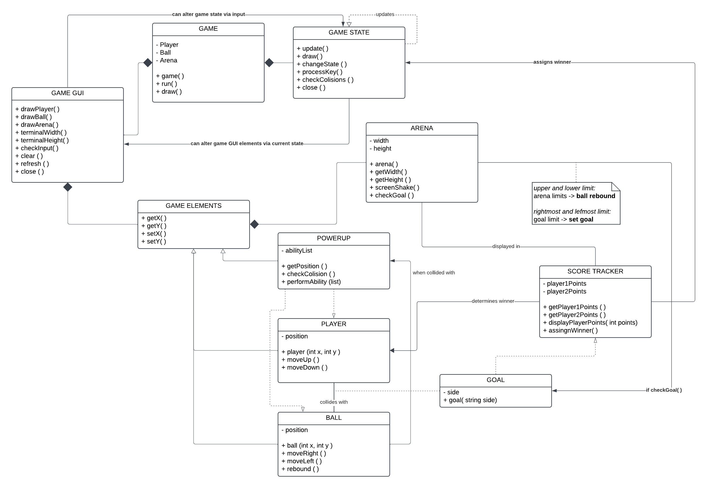
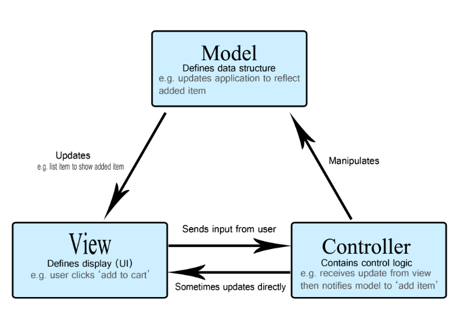
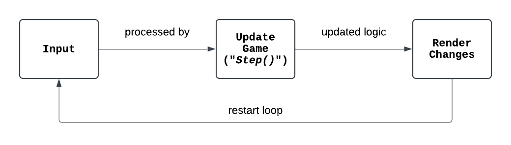
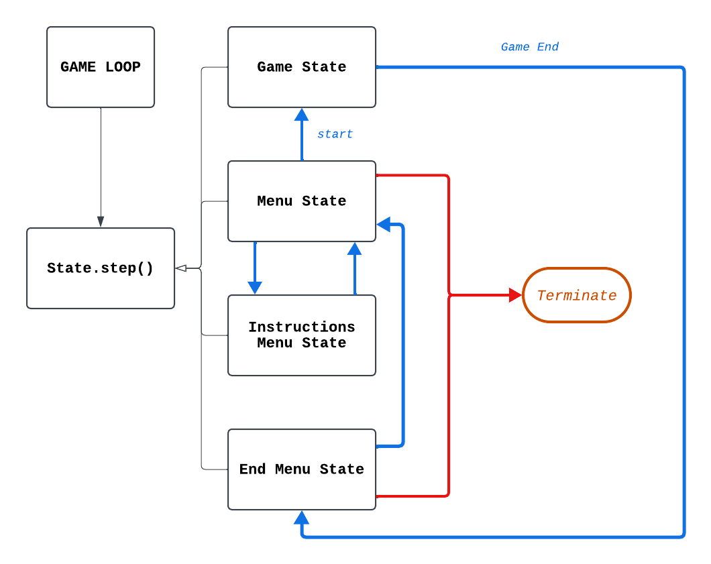
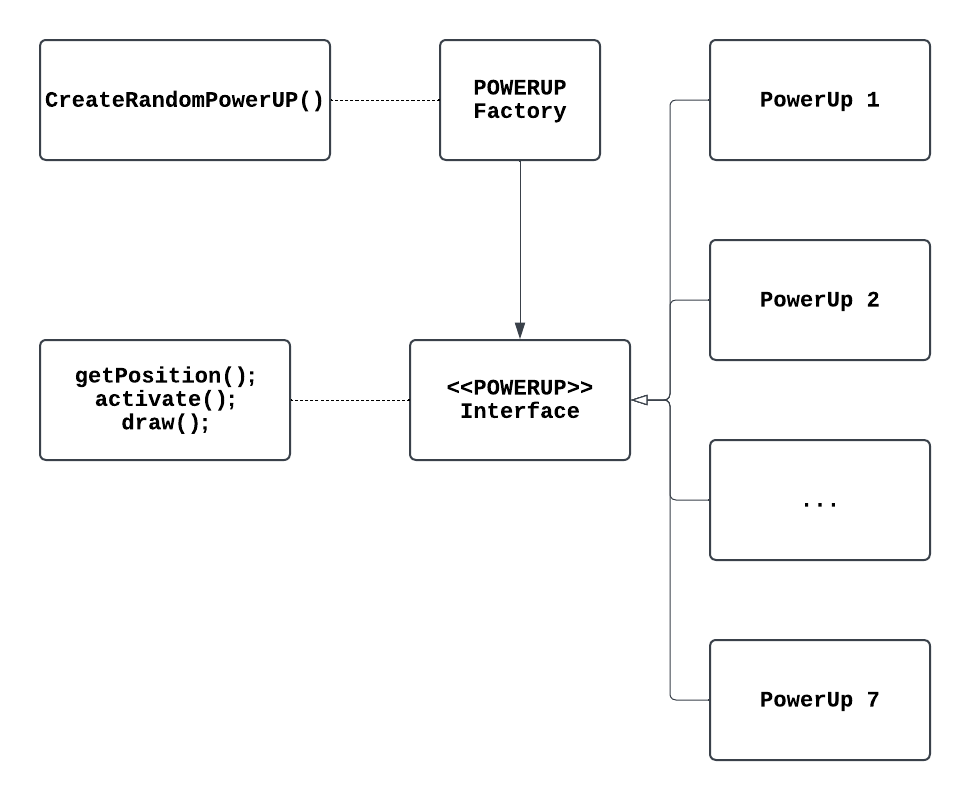
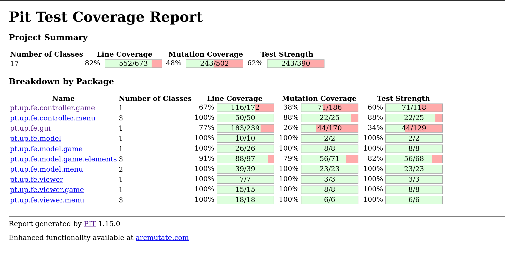
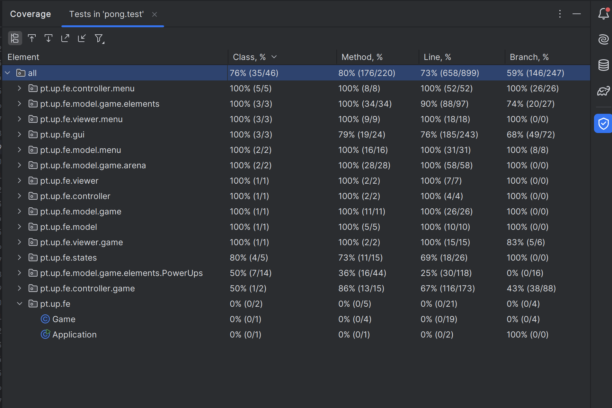

<h1 align="center">
  LDTS_t04g1 - +Pong
</h1>
<p align="center">
    
</p>


<h3 align="center"> +(MORE) PONG is a modern twist on the classic pong arcade game with the introduction of PowerUps!
    This way, we deliver a more exciting experience and fast-paced elements that enhance the gameplay.  </h3>


><p align="center">
>This project was developed by : -> André Martins Morais Pinho (up202307008) ; Carlos David Martins Coutinho (up202303946) ; Duarte Miguel Pombo Martins (up202304549)
></p>

## Table of Contents

- [Controls](#controls)
- [Implemented Features](#List-of-features)
- [Notes About Features](#notes-about-features)
- [General Structure](#general-structure)
- [Code Design](#design)
  - [Model-View-Controller](#code-structure)
  - [Game Loop](#game-loop)
  - [View Sector](#use-case-of-lanternas-gui)
  - [State Sector](#multiple-game-states)
  - [Power Up Factory Pattern](#PowerUp-System---factory-pattern)
  - [Control Sector](#Control-Sector---Arena-Controller)

- [Code Smells](#known-code-smells)
- [Code Testing](#testing)

## Controls

`w`: Moves the left player(1) up.

`s`: Moves the left player(1) down.

`↑`: Moves the right player(2) up. (ArrowUp)

`↓`: Moves the right player(2) down. (ArrowDown)

## List of Features

- **Main Menu Screen** :
  A elegant but simple design menu screen that allows players to set the duration of their games, as well as view the instructions and dive into the fun!

- **Post Match Screen** :
  After each game the result is displayed and the winner can contemplate its victory in full glory and the loser can sob its loss.

- **Game Execution Set at 45 FPS** :
  The game loop is set to run at 45 frames per second, to ensure gameplay smoothness.

- **Player Movement** :
  The players can move on the y axis, (W, S, ArrowUp, ArrowDown) to defend their goal and bounce the ball off of themselves.

- **Ball Movement and Rebound** :
  The ball rebounds will be done using trigonometry to make its movement more realistic and predictable.

- **Timer** :
  Throughout the match there will be a timer counting down to the end of the match, the player with the most goals at the end, (if neither have reached the instant win amount of goals, 5), will win, if they are tied they will enter overtime and play for a "golden goal", (whoever scores first wins).

- **Goal** :
  When the ball crosses a goal line, the stats will be updated and the moving parts go back to their initial position.

- **PowerUps** :
  From simple changes such as increasing the ball's speed, to distorting the physics of the playing field, powerUps are a way to introduce an extra layer of unpredictability and strategy. Power Ups will be spawning close to the middle of the arena, and will be acquired by the player whose paddle last bounced the ball, they are acquired and used when the ball collides with the power up, helping them score or defend their goal.

### Power Ups

#### There will be 7 power-ups in the game:

<div align="left">The Power Ups aim to help the player whom the ball just bounced off of score </div>

- **Invisible Ball** - The ball goes invisible for a short period of time, forcing the opponent to predict its movement
- **Reverse Controls** - The opponent's controls reverse (W or ↑) now move down and (S or ↓) now move up
- **Weird Bounce** - The ball bounces with an unusual and unpredictable angle of the players rather than the default one
- **Double Points** - Each goal scored by the players in a period of 10 seconds is awarded with 2 points instead!
- **Smaller Opponent** - The opponent's paddle becomes smaller, making it harder to defend the goal
- **Bigger Player** - The player's paddle becomes bigger, making it easier to defend the goal
- **Faster Player** - The player's paddle moves faster, making it easier to defend the goal

## Notes About Features

Initially, we had hopes to implement an algorithm that could face of the player as a secondary option to the 2 player local co-op game mode. However, as time passed and the deadline to deliver this project approached, we noticed we had to make a choice between polishing the existing features and balancing the powerUps to make them fair and fun or implementing a mode to face of against the computer.
We opted for quality over quantity and decided to hone these existing features to ensure a fun packed experience as opposed to a more "feature full" experience with unpolished and unbalanced parts.

## General Structure


## Design

### Code Structure

#### Challenges With Structuring Code
When creating any piece of software that deals with an interface, game loop, and even algorithms or logics it is imperative that the code is organized or well-structured to avoid the so called "spaghetti code" that later on becomes a real challenge to navigate through and expand the code with new features.
This way we adopted the Model - View - Controller pattern to ensure a well organized and structured code.

#### The Pattern
We adopted a very common programming pattern, **Model/View/Controller**, that is used throughout many GUI's (Graphical User Interfaces).
The idea is to separate the three main sectors of the code in independent sections:
- **Model** - used to represent the data.
- **View**  - displays the model and sends actions to the controller.
- **Controller** - provides a model to view and interpret user actions, and the logic and rules of the game.

#### Implementation
If someone were to check the files that contain this project, they would find out that this model is an essential staple in our projects structure.



(image source: https://developer.mozilla.org/en-US/docs/Glossary/MVC)

#### Effects
Just as previously stated, this architecture pattern allows for better code organization and segregation so that simple changes don't create many conflicts in other parts of the code.

### Game Loop

#### Challenges With Structuring Code
The Game Loop should be responsible for the continuous flow and update the state of every single entity overtime. Our team set a goal to implement a game loop that did exactly that by managing each of the three sections of the game instead of taking inputs for itself.
This way the game loop remains fairly simple to understand, having layers of abstraction hidden behind the other classes that it controls.

#### Implementation
The detailed implementation is explicit in the start method of our project's main entry point, and it can be summed up to:



#### Effects
With a simple game loop our project can expect a smooth and equal gaming experience across multiple devices and systems and the added ability to be able to control and adjust the rate of execution of the project game.

### Multiple Game States

#### Challenges With Structuring Code
It is expected of the code to be able to recognize which state it is in. Whether it's in the Menu State, the "Game" State or the Post Match State, the program should have a well-defined controller that indicates its current state along with the ability to switch states when intended/needed.
This can be accomplished in multiple ways (some better written than others) and our job was to filter those ways and implement a clean solution to this task instead of relying on inelegant ways such as looping conditionals that are being called every frame each second.

#### Implementation
In the source code, the implementation of the states logic are implemented inside the "states" directory in which every single state is carefully designed and implemented to later be called by the other portions of the code.

Here is a Diagram of the States in play:



#### Effects
The implementation of this level of polymorphism removes the need for long conditionals that are being checked each iteration and helps break the code dynamically to a point where each screen behaves independently of one another.

### Use Case of Lanterna's GUI

#### Implementation
Lanterna's GUI excels at text-based Rendering, making it a great choice for displaying characters on a windowed terminal. However, this simplicity can prove to be a double edge sword.
We opted for a display of ASCII characters for our project making the code for the "View" section much shorter and simpler to understand. However, our team later figured out that there was a price to pay for such simplicity.
In exchange for it, we were unable to implement images in our game and that meant we had to scrap the power up designs we had illustrated (Still in the docs/resources/PowerUPPNGs&SVGs directory) and, as replacement we had to get creative with the ASCII arsenal of characters.


#### Effects
As discussed previously, we used the lanterna's GUI in the way it's intended and that resulted in code simplicity in exchange for a more basic, "retro arcady" type of look.

### PowerUp System - Factory Pattern

#### Implementation
The power ups were the main gimmick of our project, as such they needed to be implemented in a simple way (since they would occupy a large portion of the source code).
For this we adopted the Factory Pattern to simplify the process of including powerUps in the arena.



The heart (factory) of this system lies in the class "PowerUP Factory" that with a call of the method "createRandomPowerUp()" automatically generates one of the seven powerUps and their respective attributes and methods.
This way everything is handled separately from the "Control" portion of the code, making it simple and easier to understand.
For a more in depth look, visit the source code in the /model/game/elements/ directory.

#### Effects
By masking away a whole level of logics and computing into a single method, we can code in an upper level of abstraction, making the "Control" portion of the source code much simpler to handle and understand.

### Control Sector - Arena Controller

#### Implementation
Having defined all the classes and methods, there needs to be a controller that invokes said methods to create a functional and playable experience. As such all the control logic (for better or for worse) is condensed in the /controller directory.
This directory contains all the logic for the actions each element needs to perform, each state being called when needed etc...

## Known "Code Smells"
Our code given some ill planning and time constrains is far from perfect and with that there are some instances where we feel could use some improvement:

- Some classes could benefit from the implementation of design patterns (like the pattern implemented in the powerUP system)
- Some classes like "LanternaGUI" and "ArenaController" could benefit from being shorter and having some methods implemented elsewhere to increase their levels of abstraction and simplicity

## Testing
For this project we used multiple test methods to try and achieve a bug free program:

- **Unit Testing** : Used when applicable in some classes of the code;
- **Mocks** : Used in conjunction with unit tests;
- **Mutation Testing** :
  
- **Coverage Testing** :
  

While testing, we aimed to cover the most critical aspects of functionality, focusing on ensuring correct behavior and interactions within the system rather than validating superficial details. In the case of the GUI, mutations related to visual elements (e.g label names, colors, or layout parameters) do not affect the functionality. As such, testing every possible mutation of these elements would offer minimal value, given that the main goal is to ensure proper user interaction and system responses. Similarly, in the ArenaControllerTests, the low mutation score is a result of focusing on testing core game logic rather than trivial or superficial variations. Many mutations tested are related to minor changes that do not impact the behavior of the game mechanics.

## Self-Evaluation (Work Contributed to the project)

- André Pinho -> 33.33%
- David Coutinho -> 33.33%
- Duarte Pombo -> 33.33%

In short, all members contributed in various fields of the project, having also shared feedback and offered help among each other and during every part of the process.

```
Final Grade : 17.7
```
